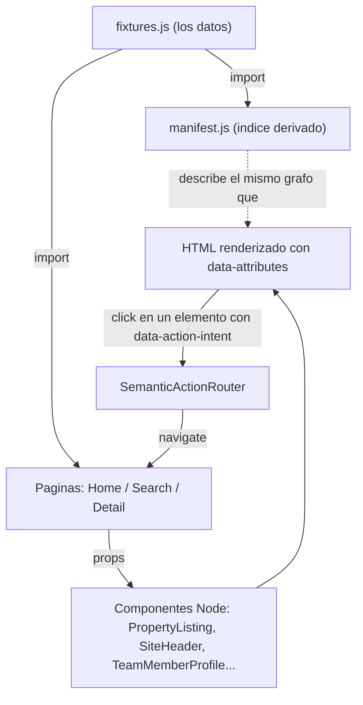

# HabitaFactoría — Semantic Scene Graph

## Resultado para JM y el equipo

Cerramos el circuito: Semantic Scene Graph (React + `data-*` + [manifest.js](src/semantic-graph/manifest.js)) → Penpot MCP → UI generada en Penpot.

La capa `src/semantic-graph` sigue **sin CSS a propósito** (Zero-Geometry): solo significado — qué es cada nodo, qué prioridad tiene, cómo se relaciona. El diseño visual no vive ahí. Se generó aparte en Penpot a partir de ese grafo, aplicando el set de tokens `HabitaFactoria/Trust` (alineado con el tema Trust de Style Dictionary / W3C). En esa generación, imágenes reales solo en marcadores de confianza (Bizum, retratos de agentes); placeholders en el resto, para no hinchar el contexto del MCP.

> **Diseño generado en Penpot:** [abrir el archivo compartido](https://design.penpot.app/#/view?file-id=8694f143-a620-8054-8008-6790ee178f11&page-id=2be68822-842f-8175-8008-677e92a06f90&section=interactions&index=0&share-id=2be68822-842f-8175-8008-6796bd4d3f53)

| Inicio (`/`) | Búsqueda (`/buscar`) | Detalle (`/propiedad/:id`) |
| :---: | :---: | :---: |
|  |  |  |

Si abrís [src/App.jsx](src/App.jsx) veréis que la app entera monta solo tres componentes: `HomeSceneGraph`, `SearchSceneGraph` y `DetailSceneGraph`. Ninguno de los tres importa Tailwind, ninguno tiene un `className` con estilos, no hay un solo `.css` propio de esa carpeta. Eso no es una carpeta a medio hacer ni un descuido: es la arquitectura entera del proyecto, decidida a propósito, y este documento explica por qué la construimos así, cómo funciona pieza por pieza, y qué decir mañana si un profesor pregunta "¿y esto por qué no tiene ni un color?".

Este README está escrito para vosotros cinco, que estáis empezando con React ahora mismo. No asumimos que sabéis lo que es un prop o un hook. Vamos a explicarlo todo con el código real que ya habéis escrito, no con ejemplos inventados.

## Índice

1. [Resultado para JM y el equipo](#resultado-para-jm-y-el-equipo)
2. [El pitch de 30 segundos](#el-pitch-de-30-segundos)
3. [Glosario exprés](#glosario-exprés)
4. [Mini-repaso de React con nuestro propio código](#mini-repaso-de-react-con-nuestro-propio-código)
5. [El concepto central: ¿qué es un Scene Graph Semántico?](#el-concepto-central-qué-es-un-scene-graph-semántico)
6. [De dónde venimos: la versión con Tailwind](#de-dónde-venimos-la-versión-con-tailwind)
7. [Estructura del proyecto, archivo por archivo](#estructura-del-proyecto-archivo-por-archivo)
8. [Cómo fluyen los datos](#cómo-fluyen-los-datos)
9. [El Action Router: cómo funcionan los botones sin estilos](#el-action-router-cómo-funcionan-los-botones-sin-estilos)
10. [Cumplimiento normativo español](#cumplimiento-normativo-español)
11. [Tokens de diseño y Penpot: de la teoría al diseño](#tokens-de-diseño-y-penpot-de-la-teoría-al-diseño)
12. [Guía de supervivencia para la presentación](#guía-de-supervivencia-para-la-presentación)
13. [Cómo trabajar con este código](#cómo-trabajar-con-este-código)
14. [Glosario completo](#glosario-completo)

---

## El pitch de 30 segundos

Memorizad este párrafo. Es vuestra red de seguridad si os quedáis en blanco delante del profesor:

> "Hemos construido HabitaFactoría, un portal de alquiler de vivienda para estudiantes en España. La parte que os vamos a enseñar separa por completo el *significado* de los datos (qué es una propiedad, cuánto cuesta, qué exige la ley) de su *aspecto visual* (colores, tamaños, dónde va cada cosa en pantalla). Todo lo que hay en `src/semantic-graph` es HTML semántico con atributos `data-*`, cero CSS — a propósito. Esa capa Zero-Geometry nos permitió generar el diseño en Penpot vía MCP sin tocar la lógica ni los datos. El folleto visual vive en Penpot; la ficha técnica sigue en React sin estilos."

Nada de "cutting-edge" ni "pionero". Es una decisión de arquitectura con un motivo concreto, y en este documento os enseñamos ese motivo con pruebas: código real, commits reales y el archivo de Penpot.

### Stack técnico (por si preguntan)

- **React 19** + **Vite**, con el **React Compiler** activado (`babel-plugin-react-compiler`, ved [vite.config.js](vite.config.js)).
- **React Router 7** para las rutas (`/`, `/buscar`, `/propiedad/:id`).
- **Tailwind CSS 4** está instalado y activo en el proyecto (se importa en [src/index.css](src/index.css)), pero ningún componente de `src/semantic-graph` lo usa. Por eso no se nota: la herramienta está ahí, pero esta carpeta ha decidido no tocarla.
- **Style Dictionary** para generar tokens de diseño, usados también al generar la UI en Penpot (ved [Tokens de diseño y Penpot](#tokens-de-diseño-y-penpot-de-la-teoría-al-diseño)).

---

## Glosario exprés

Antes de seguir, unas definiciones cortas. Las repetiremos con más detalle al final del documento, pero necesitáis esto ya para entender lo que viene:

- **Componente**: una función de JavaScript que devuelve HTML (en realidad JSX). Es el ladrillo básico de React.
- **Prop**: un dato que un componente padre le pasa a un componente hijo. Como un argumento de función.
- **Fixture**: datos de ejemplo, realistas pero inventados, que usamos mientras no hay una base de datos real detrás.
- **Manifest**: un índice, una lista que dice "esto existe, es de este tipo, y está relacionado con esto otro".
- **Data-attribute**: un atributo HTML que empieza por `data-`, como `data-node-id="property-001"`. No hace nada visualmente; es solo información.
- **Separación de responsabilidades** (*Separation of Concerns*): la idea de que cada parte del código se encarga de una sola cosa. Los datos no deberían saber de colores, y los colores no deberían saber de datos.
- **Scene Graph**: un árbol de nodos que describe qué elementos hay en una escena y cómo se relacionan entre sí. En gráficos 3D describe objetos en el espacio; aquí describe el contenido de una página web.
- **Zero-Geometry**: nuestra manera de decir "cero información de geometría" — ni tamaños, ni posiciones, ni colores. Solo significado.

---

## Mini-repaso de React con nuestro propio código

Si esta es literalmente vuestra primera vez con React, leed esto antes que nada. Cada concepto está explicado con una cita de vuestro propio código, no con un ejemplo de un tutorial.

### ¿Qué es un componente?

Un componente es una función que devuelve JSX (HTML mezclado con JavaScript). Mirad este, es de los más simples del proyecto (`src/semantic-graph/nodes/SiteChrome.jsx`, líneas 31-45):

```jsx
function NavigationAction({ item }) {
  return (
    <a
      href="#"
      data-node-id={item.id}
      data-node-type="agency"
      data-semantic-role="action"
      data-action-id={item.id}
      data-action-intent={item.intent}
      data-content-kind="action-label"
    >
      {item.label}
    </a>
  );
}
```

Eso es todo. Una función, que recibe algo entre llaves (eso son los props, siguiente punto), y devuelve una etiqueta `<a>`. Nada más raro que eso.

### Props: cómo un componente recibe datos

`{ item }` en la firma de la función de arriba es **destructuring** de props. React le pasa un único objeto a cada componente (`props`), y en vez de escribir `props.item` en todo el cuerpo de la función, lo "desempaquetamos" directamente en la firma. Otro ejemplo, con tres props a la vez (`src/semantic-graph/nodes/PropertyNodes.jsx`, línea 23):

```jsx
function PostalAddressField({ address, propertyId, contentDepth }) {
```

Esta función recibe tres cosas (`address`, `propertyId`, `contentDepth`) que le llegan desde quien la usa. Ella no las inventa, solo las recibe y las pinta.

### Renderizado condicional: mostrar algo solo si se cumple una condición

En JSX no hay un `if` dentro del `return`, así que usamos el operador `&&`. Si lo de la izquierda es `true`, se renderiza lo de la derecha; si es `false`, no se renderiza nada (`src/semantic-graph/nodes/PropertyNodes.jsx`, líneas 116-127):

```jsx
        {financialSummary.expensesIncluded && (
          <span
            data-node-id={`${financialSummary.basePrice.id}-expenses-included`}
            data-node-type="financial-summary"
            data-semantic-role="status"
            data-concept-id="expenses-included-qualifier"
            data-content-kind="status-label"
            data-inseparable-fact="true"
          >
            Gastos Incluidos
          </span>
        )}
```

Esa etiqueta "Gastos Incluidos" solo aparece si `financialSummary.expensesIncluded` es `true` en los datos. Si es `false`, ese `<span>` ni se monta.

Cuando hay que elegir entre dos cosas (no solo mostrar u ocultar una), usamos el operador ternario (`condición ? siEsVerdad : siEsFalso`), como en las líneas 337-339 del mismo archivo:

```jsx
      {registry.syncError
        ? 'Error al verificar la sincronización con la Ventanilla Única Digital.'
        : `Sincronización con la Ventanilla Única Digital: ${registry.syncStatus}`}
```

### Listas: `.map()` y la prop especial `key`

Para convertir un array de datos en una lista de elementos JSX, usamos `.map()`. React necesita que cada elemento de la lista tenga una prop `key` única, para saber cuál es cuál si la lista cambia (`src/semantic-graph/nodes/PropertyNodes.jsx`, líneas 200-214):

```jsx
      {hasItems ? (
        amenities.items.map((item) => (
          <li
            key={item.id}
            data-node-id={item.id}
            data-node-type="amenity"
            data-semantic-role="field"
            data-concept-id="property-amenity"
            data-content-kind="text"
            data-content-source="fixture"
            data-required="false"
          >
            {item.label}
          </li>
        ))
      ) : (
```

El `key={item.id}` no se ve en pantalla y no es un `data-attribute` nuestro: es algo que React exige internamente. Fijaos que usamos el `id` real del dato (`item.id`), nunca el índice de la posición en el array — así, si el orden cambia, React no se confunde.

### La prop `children`

Hay una prop especial que no hace falta declarar explícitamente en el JSX del padre: `children`. Es todo lo que pones *dentro* de las etiquetas de un componente cuando lo usas. Nuestro router de acciones la usa así (`src/semantic-graph/SemanticActionRouter.jsx`, líneas 28-60, con el interior de `handleClick` resumido — lo veremos completo más abajo):

```jsx
export function SemanticActionRouter({ children }) {
  const navigate = useNavigate();

  useEffect(() => {
    function handleClick(event) {
      // ... busca el elemento con data-action-intent más cercano ...
    }

    document.addEventListener('click', handleClick, true);
    return () => document.removeEventListener('click', handleClick, true);
  }, [navigate]);

  return children;
}
```

En [src/App.jsx](src/App.jsx) lo usamos así: `<SemanticActionRouter><Routes>...</Routes></SemanticActionRouter>`. Todo lo que está entre esas dos etiquetas es el `children` que recibe el componente, y que él simplemente devuelve tal cual (`return children;`), después de haber enganchado su lógica alrededor.

### Hooks que vais a ver: `useParams`, `useNavigate`, `useEffect`

Un **hook** es una función especial de React (siempre empieza por `use`) que os deja "engancharos" a cosas que un componente normal no puede hacer solo con JavaScript: leer la URL, navegar, o reaccionar a cuándo se monta el componente (`src/semantic-graph/pages/DetailSceneGraph.jsx`, líneas 20-23):

```jsx
export default function DetailSceneGraph() {
  const { propertyId } = useParams();
  const property =
    propertyFixtures.find((item) => item.id === propertyId) ?? propertyFixtures[0];
```

`useParams()` os da los trozos variables de la URL. Si visitáis `/propiedad/property-002`, `propertyId` vale `'property-002'`. `useNavigate()` (visto arriba en `SemanticActionRouter`) os da una función para cambiar de página sin recargar el navegador. `useEffect()` ejecuta código después de que el componente se monta — en nuestro caso, para añadir un listener de clicks al documento entero.

### Import / export y los "barrel files"

Cada archivo exporta lo que otros archivos necesitan usar, y lo importa de vuelta donde haga falta. Cuando un archivo solo reexporta cosas de otros para que se puedan importar todas desde un único sitio, se le llama **barrel file** (archivo barril, como un barril que junta cosas de varios sitios). Este es `src/semantic-graph/index.js` completo:

```js
export { default as HomeSceneGraph } from './pages/HomeSceneGraph.jsx';
export { default as SearchSceneGraph } from './pages/SearchSceneGraph.jsx';
export { default as DetailSceneGraph } from './pages/DetailSceneGraph.jsx';
export { SCENE_GRAPH_MANIFEST } from './manifest.js';
export * from './fixtures.js';
export * from './domainTypes.js';
```

Gracias a esto, [src/App.jsx](src/App.jsx) puede hacer `import { HomeSceneGraph, SearchSceneGraph, DetailSceneGraph } from './semantic-graph'` en una sola línea, sin saber ni importarle en qué subcarpeta vive cada página.

### El operador spread (`...`)

Sirve para "desparramar" el contenido de un objeto o array dentro de otro. Lo usamos para juntar varios objetos de propiedades en un único manifest (`src/semantic-graph/manifest.js`, líneas 164-171):

```js
  // ── PropertyListing entities and their full ownership subtrees ──────
  // property-001: rendered as teaser (Home), summary (Search), complete (Detail stub).
  ...buildPropertyEntries(propertyOne, { rendersSummary: true, rendersComplete: true }),
  // property-002: rendered as teaser (Home) and summary (Search) only.
  ...buildPropertyEntries(propertyTwo, { rendersSummary: true, rendersComplete: false }),
  // property-003: rendered as teaser (Home) and summary (Search) only.
  ...buildPropertyEntries(propertyThree, { rendersSummary: true, rendersComplete: false }),
};
```

También lo usamos para añadir un atributo *solo si* se cumple una condición, combinándolo con un ternario (`src/semantic-graph/nodes/PropertyNodes.jsx`, línea 113):

```jsx
{...(financialSummary.expensesIncluded ? { 'data-inseparable-fact': 'true' } : {})}
```

Si `expensesIncluded` es `true`, esa línea "desparrama" `{ 'data-inseparable-fact': 'true' }` como si fuera un atributo más del JSX. Si es `false`, desparrama un objeto vacío `{}`, o sea, no añade nada.

Con esto ya tenéis el 90% del vocabulario de React que necesitáis para entender el resto del documento. Vamos a la arquitectura.

---

## El concepto central: ¿qué es un Scene Graph Semántico?

### La analogía

Pensad en la ficha técnica de un piso en una inmobiliaria de verdad: pone metros cuadrados, planta, si tiene ascensor, el precio, si los gastos están incluidos. Esa ficha no lleva fotos bonitas ni maquetación, es puro dato. Luego, el equipo de diseño de la inmobiliaria coge esa ficha y hace el folleto con fotos, colores corporativos y una disposición cuidada.

Nuestro Scene Graph Semántico es la ficha técnica. Los componentes en `src/semantic-graph` son eso: dicen exactamente **qué es** cada cosa (`data-node-type="property"`, `data-concept-id="monthly-rent"`) pero nunca dicen de qué color pintarla ni dónde colocarla en la pantalla. El folleto (el diseño visual) ya existe en Penpot: se generó vía MCP a partir de estos mismos datos. La ficha técnica sigue sin colores ni layout a propósito; el diseño no se mezcló con React.

### La definición técnica

Un "scene graph" en gráficos por ordenador es un árbol de nodos que describe qué objetos hay en una escena y cómo se relacionan entre sí (por ejemplo, "la rueda es hija del coche"). Nosotros usamos la misma idea, pero para una página web: cada elemento HTML tiene un `data-node-id` único, un `data-node-type` (qué clase de cosa es: `property`, `agent`, `address`...), un `data-semantic-role` (si es una `entity`, un `field`, una `action`, una `collection`...) y, cuando hace falta, un `data-ref` + `data-rel` que dice a qué otro nodo está conectado y de qué manera (`belongs-to`, `locates`, `prices`...). [manifest.js](src/semantic-graph/manifest.js) recopila ese árbol entero en un único objeto, sin necesidad de abrir el navegador.

### La doctrina Zero-Geometry

"Zero-Geometry" es nuestra forma de decir: cero información sobre tamaño, posición o color. Ni un `className`, ni un `style`, ni siquiera el orden en el que aparecen las cosas se usa para decidir importancia visual. Está escrito literalmente en los comentarios del propio código (`src/semantic-graph/nodes/PropertyNodes.jsx`, líneas 9-13):

```js
 * `contentDepth` ('teaser' | 'summary' | 'complete') is a content-scope
 * decision (how much of this entity's real content belongs in a given
 * page context — Home teaser vs. Search result vs. Detail stub) and
 * carries no visual instruction; Penpot still decides size/placement for
 * whatever subset of nodes is present.
```

Y en las tres páginas (el mismo comentario, copiado literalmente en cada una — aquí, `HomeSceneGraph.jsx`, líneas 4-8):

```js
 * Source order is authoritative for reading sequence, keyboard/focus
 * order, and narrative sequence only. It does not prescribe coordinates,
 * columns, alignment, proximity, size, or visual prominence. Business
 * importance is carried exclusively by data-business-priority, never by
 * position.
```

Es decir: el orden en el que escribimos las cosas en el JSX solo importa para el orden de lectura y de tabulación con teclado (accesibilidad), nunca para decir "esto va arriba a la izquierda en grande". Si algo es importante de verdad, lo decimos explícitamente con `data-business-priority="critical"`, no colocándolo en una posición concreta.

### "Pero esto necesitará CSS en algún momento, ¿no?"

Sí, por supuesto. Una web sin ningún estilo no es utilizable por un usuario final. La diferencia es *cuándo* y *quién* decide ese aspecto. En nuestro caso: la capa `src/semantic-graph` sigue sin CSS a propósito; el diseño visual se generó en Penpot a partir del grafo semántico, usando los tokens del pipeline ([build-tokens.mjs](build-tokens.mjs) + los temas en `src/theme/`). Eso no mete CSS en la capa semántica: los tokens se aplicaron en Penpot, no como `className` en React. Lo explicamos con detalle en [Tokens de diseño y Penpot](#tokens-de-diseño-y-penpot-de-la-teoría-al-diseño).

---

## De dónde venimos: la versión con Tailwind

Esto no es una historia inventada para quedar bien. Está en el propio historial de git del repositorio:

```bash
$ git log --oneline
e45f7fe feat(app): route semantic scene graph as app entry
127f69a feat(architecture): implement Zero-Geometry Semantic Scene Graph
a8af89b refactor: rebrand to HabitaFactoría and finalize Atomic Design architecture
dbc9e75 feat(tailwind): migrate to Tailwind CSS v4 with W3C design tokens
f5eb9ac feat(deps): install Tailwind CSS v4 with PostCSS and Autoprefixer
5a6ce8c feat: add W3C design tokens
2f8b919 chore: add comprehensive .gitignore for React/Vite project
019ae56 chore: add react files and folders
0f7338f first commit
```

Empezamos instalando Tailwind CSS y montando una arquitectura Atomic Design normal y corriente, con componentes visuales de verdad. [src/pages/Home.jsx](src/pages/Home.jsx) todavía existe en el repo — no lo borramos — y en su primera línea dice explícitamente que ya no se usa:

```jsx
/** @deprecated Replaced by src/semantic-graph/pages/HomeSceneGraph.jsx — not mounted from App. */
```

Así se veía esa versión, con clases de Tailwind y estilos en línea mezclados con el contenido (mismo archivo, líneas 55-67):

```jsx
        <section className="bg-gray-50 px-4 py-16 sm:px-6 lg:px-8">
          <div className="mx-auto max-w-7xl">
            <div className="mx-auto max-w-3xl text-center">
              <h1 className="mb-4 text-3xl font-bold tracking-tight sm:text-4xl"
                  style={{ color: 'var(--color-primary)' }}>
                HabitaFactoría
              </h1>
              <p className="text-lg leading-relaxed" style={{ color: 'var(--color-text-body)' }}>
                Desde 2018, ayudamos a estudiantes a encontrar el hogar perfecto en Madrid.
                Nuestra misión es ofrecer alquileres transparentes, sin comisiones ocultas,
                con <strong>"Gastos Incluidos"</strong> y la tranquilidad de un contrato
                legal bajo la normativa <strong>RD 1312/2024</strong>.
```

Funcionaba. Se veía bien. Y aun así, en el commit `127f69a` decidimos reconstruirlo entero como Zero-Geometry, y en `e45f7fe` lo enganchamos como la página que de verdad se monta en la app. No borramos la versión anterior a propósito: es la prueba de que fue una decisión, no un punto de partida por defecto.

---

## Estructura del proyecto, archivo por archivo

Toda la arquitectura vive dentro de `src/semantic-graph/`:

```
src/semantic-graph/
├── domainTypes.js          (el diccionario: qué forma tiene cada cosa)
├── fixtures.js              (los datos: instancias reales de ese diccionario)
├── manifest.js               (el índice: qué existe y cómo se relaciona)
├── index.js                  (barrel export para el resto de la app)
├── SemanticActionRouter.jsx  (qué pasa cuando haces click)
├── nodes/
│   ├── PropertyNodes.jsx     (una propiedad en alquiler y todo lo suyo)
│   ├── SiteChrome.jsx        (cabecera y pie de página compartidos)
│   ├── AgencyNodes.jsx       (historia de la agencia y equipo)
│   └── SearchNodes.jsx       (búsqueda y listados de propiedades)
└── pages/
    ├── HomeSceneGraph.jsx
    ├── SearchSceneGraph.jsx
    └── DetailSceneGraph.jsx
```

### `domainTypes.js` — el diccionario del proyecto

**Qué es:** un archivo que no ejecuta nada en tiempo real. Son comentarios especiales (`JSDoc`, con `@typedef`) que describen la forma de cada tipo de dato, más cuatro arrays con "vocabulario cerrado" (las únicas opciones válidas para un campo).

**Qué problema resuelve:** sin TypeScript, es muy fácil que dos personas del equipo escriban una propiedad con campos ligeramente distintos. Este archivo es el contrato que dice "una `Property` siempre tiene estos campos, con estos tipos, ni más ni menos". Este es el `@typedef` de `FinancialSummary` (líneas 34-39):

```js
 * @typedef {Object} FinancialSummary
 * @property {string} id
 * @property {MonetaryAmount} basePrice
 * @property {boolean} expensesIncluded
 * @property {MonetaryAmount|null} communityFees
 * @property {MonetaryAmount|null} taxObligation
```

Y el "vocabulario cerrado" del archivo, las únicas opciones válidas para varios campos (líneas 113-117):

```js
/** Closed vocabulary — internal consistency helpers, not new data- attributes. */
export const CEE_RATINGS = ['A', 'B', 'C', 'D', 'E', 'F', 'G'];
export const REGIONAL_REGISTRY_TYPES = ['RTA', 'HUT', 'VUT'];
export const CONTRACT_TYPES = ['vivienda-habitual', 'temporal', 'comercial'];
export const CONTENT_DEPTHS = ['teaser', 'summary', 'complete'];
```

**Analogía:** es como el formulario en blanco de un contrato de alquiler. No tiene ningún inquilino real todavía, solo dice qué casillas hay que rellenar y de qué tipo es cada una.

### `fixtures.js` — los datos de ejemplo

**Qué es:** las instancias reales (pero de prueba) de esas formas: una agencia, tres agentes, tres propiedades, el menú de navegación, etc.

**Qué problema resuelve:** todavía no hay una base de datos ni una API detrás. Este archivo hace de "fuente única de la verdad" mientras tanto — y como cada objeto lleva su propio `id` estable, el resto del código nunca tiene que inventarse un identificador a mano. Ejemplo, líneas 36-44:

```js
  professionalCredential: {
    id: 'compliance-agency-credential-001',
    registrationNumber: 'HF-2024-001',
    jurisdiction: 'ES',
  },
  bizumAsset: {
    id: 'media-bizum-mark-001',
  },
};
```

Y una propiedad con su precio (líneas 96-102):

```js
    financialSummary: {
      id: 'financial-summary-001',
      basePrice: { id: 'price-001', amount: 620, currency: 'EUR', period: 'month' },
      expensesIncluded: true,
      communityFees: { id: 'community-fees-001', amount: 45, currency: 'EUR', period: 'month' },
      taxObligation: { id: 'tax-obligation-001', amount: 180, currency: 'EUR', period: 'year' },
    },
```

**Analogía:** es una hoja de Excel con filas de ejemplo, realistas pero inventadas, para poder trabajar en la app antes de que exista el backend de verdad.

### `manifest.js` — el índice de todo lo que existe

**Qué es:** un objeto plano que lista *cada* `data-node-id` que se usa en cualquiera de las tres páginas, junto con su tipo, su rol semántico y a qué otros nodos está conectado.

**Qué problema resuelve:** sin esto, para saber "¿qué nodos existen en la app y cómo se relacionan?" habría que abrir el navegador y rebuscar en el DOM a mano. Con el manifest, cualquier herramienta (o cualquier persona) puede leer un único archivo de JavaScript y saberlo todo, sin ejecutar la app. Las dos funciones base (líneas 18-24):

```js
function entry(nodeType, semanticRole, refs = []) {
  return { nodeType, semanticRole, refs };
}

function findAgent(agentId) {
  return agentFixtures.find((agent) => agent.id === agentId);
}
```

Y el arranque de `buildPropertyEntries`, que construye la parte del índice que le corresponde a cada propiedad (líneas 32-45):

```js
function buildPropertyEntries(property, { rendersSummary, rendersComplete }) {
  const p = property.id;
  const fs = property.financialSummary;
  const addr = property.address;
  const entries = {
    [p]: entry('property', 'entity', [{ ref: 'agency-001', rel: 'belongs-to' }]),
    [`${p}-title`]: entry('property', 'field'),
    [addr.id]: entry('address', 'entity', [{ ref: p, rel: 'locates' }]),
    [`${addr.id}-municipality`]: entry('address', 'field'),
    [`${addr.id}-region`]: entry('address', 'field'),
    [fs.id]: entry('financial-summary', 'entity', [{ ref: p, rel: 'prices' }]),
    [fs.basePrice.id]: entry('financial-summary', 'field'),
    [property.compliance.energyRating.id]: entry('compliance-record', 'status', [{ ref: p, rel: 'validates' }]),
  };
```

Fijaos en un detalle importante: `buildPropertyEntries` recibe la propiedad *y* en qué páginas se va a renderizar (`rendersSummary`, `rendersComplete`), y solo añade al índice los nodos que de verdad se van a pintar en ese caso. Así el manifest nunca dice "esto existe" cuando en realidad no se llega a mostrar.

**Analogía:** es el índice de un libro, o un mapa del sitio (*sitemap*) de una web: lista cada página/sección, de qué trata, y a qué otras está enlazada, sin que tengas que leerte el libro entero para saber qué hay dentro.

### `nodes/PropertyNodes.jsx` — el corazón: una propiedad en alquiler

**Qué es:** el componente `PropertyListing` y todos los sub-componentes que forman su "árbol de propiedad": dirección, precio, comodidades, fotos, y los cuatro tipos de registro de cumplimiento normativo (certificado energético, registro autonómico, DIA, honorarios de agencia).

**Qué problema resuelve:** es la pieza que se reutiliza en las tres páginas, cambiando solo cuánto contenido muestra (`contentDepth`: `'teaser'` en Home, `'summary'` en Search, `'complete'` en Detail), pero manteniendo siempre el mismo `data-node-id` para la misma propiedad real. Un sub-componente completo, `ComplianceRecordCEE` (líneas 276-298):

```jsx
function ComplianceRecordCEE({ energyRating, propertyId }) {
  return (
    <p
      data-node-id={energyRating.id}
      data-node-type="compliance-record"
      data-semantic-role="status"
      data-concept-id="energy-rating"
      data-content-kind="status-label"
      data-content-source="fixture"
      data-required="true"
      data-business-priority="high"
      data-record-status="fixture"
      data-verification-status="unverified"
      data-cee-rating={energyRating.rating}
      data-jurisdiction="ES"
      data-applicability="mandatory"
      data-ref={propertyId}
      data-rel="validates"
    >
      Certificado de Eficiencia Energética: categoría {energyRating.rating}
    </p>
  );
}
```

Y el arranque de `PropertyListing`, el componente que junta todas las piezas (líneas 529-541):

```jsx
export function PropertyListing({ property, contentDepth }) {
  const agent = findAgent(property.assignedAgentId);
  return (
    <article
      data-node-id={property.id}
      data-node-type="property"
      data-semantic-role="entity"
      data-contract-type={property.contractType}
      data-business-priority={contentDepth === 'teaser' ? 'medium' : 'high'}
      data-ref="agency-001"
      data-rel="belongs-to"
    >
      <h3
```

**Analogía:** son las piezas de Lego más pequeñas del set "propiedad en alquiler": la pieza dirección, la pieza precio, la pieza foto. `PropertyListing` es el plano que dice en qué orden se montan esas piezas.

### `nodes/SiteChrome.jsx` — cabecera y pie de página compartidos

**Qué es:** `SiteHeader` y `SiteFooter`, que se repiten igual (mismos `data-node-id`) en las tres páginas, porque son la misma cabecera y el mismo pie de página real, no uno nuevo por cada página. Ejemplo, `BrandIdentityMark` (líneas 12-29):

```jsx
function BrandIdentityMark({ agency }) {
  return (
    <a
      href="/"
      data-node-id={`${agency.id}-brand-mark`}
      data-node-type="agency"
      data-semantic-role="field"
      data-concept-id="agency-trade-name"
      data-content-kind="text"
      data-content-source="fixture"
      data-required="true"
      data-ref={agency.id}
      data-rel="belongs-to"
    >
      {agency.tradeName}
    </a>
  );
}
```

**Analogía:** es como el membrete y el pie de una carta de empresa: aparece igual en todas las cartas que mandas, porque es la misma empresa, no una nueva cada vez.

### `nodes/AgencyNodes.jsx` — historia de la agencia y equipo

**Qué es:** `AgencyIntroduction` (la historia/misión de HabitaFactoría, requerida por [CLAUDE.md](CLAUDE.md) para la Welcome Page) y `TeamMemberProfileCollection` (las fotos y nombres del equipo de agentes). Este último completo (líneas 145-164):

```jsx
export function TeamMemberProfileCollection({ agents }) {
  return (
    <section
      data-node-id="team-member-collection-001"
      data-node-type="agent"
      data-semantic-role="collection"
      data-cardinality="2..12"
      data-required="true"
      data-ref="agency-001"
      data-rel="belongs-to"
    >
      <CollectionHeading nodeId="team-member-collection-001-heading" nodeType="agent">
        Nuestro Equipo
      </CollectionHeading>
      {agents.map((agent) => (
        <TeamMemberProfile key={agent.id} agent={agent} />
      ))}
    </section>
  );
}
```

Fijaos en `data-cardinality="2..12"`: es una pista para quien diseñe (o para Penpot al generar layout) de que esta colección puede tener entre 2 y 12 agentes — información útil para un diseño que tenga que adaptarse, sin que nosotros digamos "esto va en una rejilla de 3 columnas".

### `nodes/SearchNodes.jsx` — búsqueda y "Vitrina" de propiedades

**Qué es:** el resumen de criterios de búsqueda, la lista completa de resultados (página Search) y la "Vitrina" de propiedades destacadas (página Home). `FeaturedListingCollection` completo (líneas 67-97):

```jsx
export function FeaturedListingCollection({ properties }) {
  return (
    <section
      data-node-id="featured-listing-collection-001"
      data-node-type="property"
      data-semantic-role="collection"
      data-cardinality="3..12"
      data-required="true"
      data-business-priority="critical"
    >
      <CollectionHeading nodeId="featured-listing-collection-001-heading" nodeType="property">
        Vitrina de Propiedades
      </CollectionHeading>
      {properties.map((property) => (
        <PropertyListing key={property.id} property={property} contentDepth="teaser" />
      ))}
      <button
        type="button"
        data-node-id="action-navigate-search-from-showcase-001"
        data-node-type="property"
        data-semantic-role="action"
        data-action-id="action-navigate-search-from-showcase-001"
        data-action-intent="navigate-search"
        data-content-kind="action-label"
        data-required="false"
      >
        Ver Todas las Propiedades
      </button>
    </section>
  );
}
```

Aquí veis **composición de componentes** en acción: `FeaturedListingCollection` no sabe pintar una propiedad, así que usa `PropertyListing` (importado de `PropertyNodes.jsx`) y le pasa `contentDepth="teaser"` para que muestre la versión resumida.

### `pages/*.jsx` — las tres páginas

**Qué son:** los tres componentes que de verdad se montan desde [src/App.jsx](src/App.jsx). Cada uno cumple la estructura obligatoria `[HEADER, MAIN, FOOTER]` de [CLAUDE.md](CLAUDE.md), y simplemente combinan los "nodes" de arriba. Aquí está `HomeSceneGraph.jsx` completo, las 37 líneas del archivo:

```jsx
/**
 * SEMANTIC SCENE GRAPH — ZERO GEOMETRY
 *
 * Source order is authoritative for reading sequence, keyboard/focus
 * order, and narrative sequence only. It does not prescribe coordinates,
 * columns, alignment, proximity, size, or visual prominence. Business
 * importance is carried exclusively by data-business-priority, never by
 * position.
 *
 * Home page — Agency History, Agent (Team) profiles, Property Showcase
 * ("Vitrina"), per CLAUDE.md Welcome Page requirements.
 */
import { SiteHeader, SiteFooter } from '../nodes/SiteChrome.jsx';
import { AgencyIntroduction, TeamMemberProfileCollection } from '../nodes/AgencyNodes.jsx';
import { FeaturedListingCollection } from '../nodes/SearchNodes.jsx';
import { agencyFixture, agentFixtures, propertyFixtures } from '../fixtures.js';

export default function HomeSceneGraph() {
  return (
    <div
      data-scene-schema="proptech-semantic-graph"
      data-scene-version="1.0.0"
      data-locale="es-ES"
      data-node-id="home-page-001"
      data-node-type="page"
      data-semantic-role="entity"
    >
      <SiteHeader />
      <main>
        <AgencyIntroduction agency={agencyFixture} />
        <TeamMemberProfileCollection agents={agentFixtures} />
        <FeaturedListingCollection properties={propertyFixtures} />
      </main>
      <SiteFooter />
    </div>
  );
}
```

`SearchSceneGraph.jsx` y `DetailSceneGraph.jsx` siguen exactamente el mismo patrón, solo que combinando distintos "nodes". `DetailSceneGraph` tiene una cosa extra: lee el id de la propiedad directamente de la URL con `useParams()` (ya lo vimos en el mini-repaso).

### `index.js` y `SemanticActionRouter.jsx`

Ya los vimos en el mini-repaso: `index.js` es el barrel export que junta todo para el resto de la app, y `SemanticActionRouter.jsx` es quien convierte un click en una navegación de verdad. Le dedicamos una sección entera más abajo porque suele ser lo que más preguntas genera.

---

## Cómo fluyen los datos

Este es el resumen visual de todo lo anterior:



En palabras:

1. **`fixtures.js` es la única fuente de datos.** Nadie más inventa un `id` o un precio; todo sale de ahí.
2. **`manifest.js` importa esos mismos fixtures** y construye su índice a partir de ellos — nunca a mano, nunca con datos inventados aparte. Por eso el manifest no puede "desincronizarse" de lo que de verdad se renderiza: usa las mismas funciones de derivación de ids que usan los componentes.
3. **Las páginas también importan esos fixtures** y se los pasan a los "nodes" como **props**. Por ejemplo, `HomeSceneGraph` le pasa `agents={agentFixtures}` a `TeamMemberProfileCollection`, que simplemente los recibe y los recorre con `.map()`.
4. **Los "nodes" componen otros nodes más pequeños** (`SearchNodes.jsx` importa `PropertyListing` de `PropertyNodes.jsx`), y al final todos devuelven HTML con sus `data-attributes`.
5. **Los datos siempre fluyen hacia abajo, de padre a hijo, vía props.** Nunca al revés: un componente hijo no puede "escribir" en el fixture de su padre.
6. **Las acciones fluyen hacia arriba**, pero no como props: como eventos del navegador. Cuando pulsas un botón, el evento sube por el DOM hasta que lo captura `SemanticActionRouter`, que decide a dónde navegar.

Esto es lo que en React se suele resumir como **"single source of truth"** (una única fuente de la verdad: los fixtures) y **"data down, actions up"** (los datos bajan por props, las acciones suben por eventos).

---

## El Action Router: cómo funcionan los botones sin estilos

Una pregunta que seguro os hacen: "si no hay `onClick` en cada botón, ¿cómo funciona esto?" La respuesta está en un único archivo, [SemanticActionRouter.jsx](src/semantic-graph/SemanticActionRouter.jsx), líneas 11-57 (toda la lógica real, sin resumir):

```jsx
const NAVIGATION_INTENTS = new Set(['navigate-home', 'navigate-search', 'expand-detail']);

function resolveNavigationTarget(intent, element) {
  switch (intent) {
    case 'navigate-home':
      return '/';
    case 'navigate-search':
      return '/buscar';
    case 'expand-detail': {
      const propertyId = element.getAttribute('data-ref');
      return propertyId ? `/propiedad/${propertyId}` : null;
    }
    default:
      return null;
  }
}

export function SemanticActionRouter({ children }) {
  const navigate = useNavigate();

  useEffect(() => {
    function handleClick(event) {
      const actionElement = event.target.closest('[data-action-intent]');
      if (actionElement) {
        const intent = actionElement.getAttribute('data-action-intent');
        if (NAVIGATION_INTENTS.has(intent)) {
          const target = resolveNavigationTarget(intent, actionElement);
          if (target) {
            event.preventDefault();
            navigate(target);
          }
        } else if (actionElement.tagName === 'A') {
          event.preventDefault();
        }
        return;
      }

      const homeAnchor = event.target.closest('a[href="/"]');
      if (homeAnchor) {
        event.preventDefault();
        navigate('/');
      }
    }

    document.addEventListener('click', handleClick, true);
    return () => document.removeEventListener('click', handleClick, true);
  }, [navigate]);

  return children;
}
```

En vez de poner un `onClick` distinto en cada uno de los botones repartidos por 5 archivos, ponemos **un único listener** en `document`, cuando `SemanticActionRouter` se monta. Cada vez que alguien hace click en cualquier parte de la página:

1. `event.target.closest('[data-action-intent]')` busca hacia arriba, desde donde se hizo click, el elemento más cercano que tenga un atributo `data-action-intent`.
2. Si lo encuentra, lee ese atributo (por ejemplo `"navigate-search"`) y decide a dónde navegar.
3. Si el elemento es un `<a>` sin una intención de navegación reconocida (como los enlaces `href="#"` del footer legal), simplemente evita que salte al principio de la página.

El `true` al final de `addEventListener('click', handleClick, true)` significa que escuchamos en **fase de captura**: el navegador nos avisa del click *antes* de que le llegue al propio botón, de arriba hacia abajo, en vez de esperar a que "burbujee" de abajo hacia arriba. Para lo que necesitamos aquí (interceptar la navegación antes de que el navegador haga nada por su cuenta) es la opción más fiable.

Esto también encaja con la doctrina Zero-Geometry: no hay que añadir ningún `<div onClick={...}>` envolviendo cosas, ni contaminar cada "node" con lógica de navegación. Un único router, unas reglas centralizadas.

---

## Cumplimiento normativo español

Todo lo que exige la ley española para el alquiler vive como **dato**, no como texto suelto pegado en un componente visual. Aquí está el mapeo exacto entre lo que exige cada norma y dónde vive en el código:

| Requisito legal | Qué exige (resumen) | Dónde vive en el código |
|---|---|---|
| **RD 1312/2024 / Ventanilla Única Digital** | Registrar los alquileres de temporada/turísticos con un número de registro único y sincronizarlo con la ventanilla estatal. | `regionalRegistry` (`RTA`/`HUT`/`VUT` + `syncStatus`) en [domainTypes.js](src/semantic-graph/domainTypes.js) y [fixtures.js](src/semantic-graph/fixtures.js), renderizado por `ComplianceRecordRegionalRegistry` en [PropertyNodes.jsx](src/semantic-graph/nodes/PropertyNodes.jsx) (líneas 300-343) con `data-ventanilla-digital-sync`. El registro de la propia agencia, `AgencyProfessionalCredential` en [SiteChrome.jsx](src/semantic-graph/nodes/SiteChrome.jsx) (líneas 151-169), menciona literalmente "Ventanilla Única Digital". |
| **Decreto 218/2005 (Junta de Andalucía)** | Exigir un Documento Informativo Abreviado (DIA) para viviendas comercializadas en Andalucía, con superficie útil/construida, gastos de comunidad e IBI. | `compliance.dia` en [domainTypes.js](src/semantic-graph/domainTypes.js) y [fixtures.js](src/semantic-graph/fixtures.js), renderizado por `ComplianceRecordDIA` en [PropertyNodes.jsx](src/semantic-graph/nodes/PropertyNodes.jsx) (líneas 345-433), que cita el decreto en su propio texto. Solo aparece en `property-001` (Sevilla, Andalucía) porque el campo es `null` en las otras dos propiedades — la ley solo aplica en esa comunidad. |
| **Bizum** | No es una ley, es un método de pago instantáneo muy usado en España. Mostrarlo comunica confianza y "sin comisiones ocultas". | `paymentMethodFixture` + `bizumAsset` en [fixtures.js](src/semantic-graph/fixtures.js), renderizado por `PaymentMethodAssertion` en [SiteChrome.jsx](src/semantic-graph/nodes/SiteChrome.jsx) (líneas 116-149). |
| **"Gastos Incluidos"** | Convención del mercado de alquiler español: dejar claro si el precio anunciado incluye comunidad/suministros, sin separar visualmente esa aclaración del precio (para evitar anuncios engañosos). | `financialSummary.expensesIncluded` (booleano) en [domainTypes.js](src/semantic-graph/domainTypes.js), renderizado dentro de `FinancialSummary` en [PropertyNodes.jsx](src/semantic-graph/nodes/PropertyNodes.jsx) con el atributo `data-inseparable-fact="true"`. |

¿Por qué todo esto vive en la capa semántica y no en un componente con Tailwind? Porque si "Gastos Incluidos" fuera solo un `<span className="badge-verde">`, el verde y la forma de "badge" serían decisiones de diseño mezcladas con una obligación de transparencia hacia el inquilino. Aquí, la obligación legal vive en el dato (`expensesIncluded: true`) y en su significado (`data-inseparable-fact`), no en un color. Quien genere o revise el diseño (como en Penpot) no puede "olvidarse" de mostrarlo, porque no es una decisión estética: es un dato marcado como obligatorio.

Una aclaración importante: todos estos registros llevan también `data-record-status="fixture"` y `data-verification-status="unverified"`. Eso no es un adorno, es honestidad: le dice a cualquiera que lea el dato que esto es un ejemplo de prueba, no una afirmación legal ya verificada de verdad. Es evitar mentir por omisión.

---

## Tokens de diseño y Penpot: de la teoría al diseño

La separación entre datos y diseño no es solo una idea bonita sin nada detrás: el proyecto tiene, aparte, un sistema de **tokens de diseño** con Style Dictionary. La cabecera de [build-tokens.mjs](build-tokens.mjs) (líneas 1-10) lo explica:

```js
/**
 * Style Dictionary build script — HabitaFactoría
 *
 * Usage:
 *   node build-tokens.mjs trust     → reads src/theme/theme-trust.json
 *   node build-tokens.mjs vibrant   → reads src/theme/theme-vibrant.json
 *
 * Generates: src/styles/tokens.css
 * 3-tier hierarchy: Base → Semantic → Component
 */
```

Y así se ve un token de color en [src/theme/theme-trust.json](src/theme/theme-trust.json) (líneas 3-8):

```json
  "color": {
    "$type": "color",
    "primary": {
      "$value": "#0047AB",
      "$description": "Royal Blue — primary brand color, used for CTAs, links and key UI accents."
    },
```

`npm run build:tokens` (o `build:tokens:vibrant` para el otro tema) lee uno de esos dos archivos JSON con formato W3C Design Tokens y genera `src/styles/tokens.css` con tres capas: colores/espaciados base, alias con significado (semánticos) y variables específicas de componente. Es un sistema completamente independiente de `src/semantic-graph`: la capa semántica **no** importa ese CSS.

Ese pipeline ya se usó al generar el diseño. Con Penpot MCP partimos del Scene Graph (páginas `home-page-001`, `search-page-001`, `detail-page-001`, nodos con `data-*`, [manifest.js](src/semantic-graph/manifest.js)) y generamos la propuesta visual en Penpot. En ese archivo quedó el set de tokens `HabitaFactoria/Trust` (colores, spacing, radius y shadows alineados con el tema Trust). Activos híbridos: imágenes reales solo en marcadores de confianza (Bizum, retratos de agentes); placeholders en el resto, para mantener pequeño el contexto del MCP. Nadie tuvo que tocar los fixtures ni una línea de `PropertyNodes.jsx` para maquetar.

> **Diseño en Penpot:** [abrir el archivo compartido](https://design.penpot.app/#/view?file-id=8694f143-a620-8054-8008-6790ee178f11&page-id=2be68822-842f-8175-8008-677e92a06f90&section=interactions&index=0&share-id=2be68822-842f-8175-8008-6796bd4d3f53)

---

## Guía de supervivencia para la presentación

### El pitch de 30 segundos (otra vez, para tenerlo a mano)

> "Hemos construido HabitaFactoría, un portal de alquiler de vivienda para estudiantes en España. La parte que os vamos a enseñar separa por completo el significado de los datos de su aspecto visual. Todo lo que hay en `src/semantic-graph` es HTML semántico con atributos `data-*`, cero CSS a propósito. El diseño visual ya está en Penpot, generado vía MCP desde ese grafo, sin tocar la lógica ni los datos."

### Preguntas frecuentes del profesor (con respuestas guionizadas)

Cada respuesta está pensada para decirse en voz alta en menos de 20 segundos. Si el profesor insiste, hay una frase extra de apoyo.

| Pregunta | Respuesta (máx. 3 frases) |
|---|---|
| **¿Por qué no hay CSS ni Tailwind aquí?** | No hay CSS porque esta capa solo describe qué es cada cosa, no cómo se ve — Zero-Geometry a propósito. El diseño visual ya se generó en Penpot a partir de estos mismos datos y tokens, sin tocar la lógica. *Si insiste: abrid el enlace de Penpot; `src/semantic-graph` sigue sin estilos porque el folleto no vive en React.* |
| **¿Qué es exactamente un prop? Explicádmelo.** | Un prop es un dato que un componente padre le pasa a uno hijo, como el argumento de una función. Por ejemplo, `HomeSceneGraph` le pasa `agents={agentFixtures}` a `TeamMemberProfileCollection`, y ese componente solo los recibe y los pinta, no se inventa nada. |
| **¿Por qué separasteis los datos (fixtures) de los componentes?** | Porque si los mezclamos, cualquier cambio de diseño obliga a tocar la lógica, y cualquier cambio de dato obliga a tocar el diseño. Separados, `fixtures.js` puede cambiar sin romper nada visual, y al revés. |
| **¿Cómo sabéis que esto funciona si no se ve nada bonito?** | En React, el HTML se renderiza igual, con todos los `data-*` correctos, solo que sin colores ni maquetación: DevTools lo demuestran frente al manifest. El aspecto visual no está vacío — está en Penpot, generado desde ese mismo grafo. |
| **¿Esto es React puro o algún framework extra?** | React puro, con React Router para las rutas. No hay ninguna librería de componentes visuales en `semantic-graph`, porque esa capa no lleva UI estilizada; el diseño visual está en Penpot. |
| **¿Por qué el mismo `property-001` aparece en Home, Search y Detail?** | Porque es la misma propiedad real, no tres propiedades distintas. El id viene de `fixtures.js` y tanto el manifest como los componentes lo reutilizan tal cual, así nunca pueden desincronizarse. |
| **¿Qué pasa si hago click en un botón, si no hay `onClick` en cada uno?** | Hay un único componente, `SemanticActionRouter`, que escucha todos los clicks del documento y mira el atributo `data-action-intent` del elemento pulsado. Según ese valor decide a qué ruta navegar, en vez de que cada botón tenga su propio manejador. |
| **¿Esto lo entendisteis vosotros o solo lo copiasteis?** | Lo entendimos nosotros: el historial de commits lo demuestra. Empezamos con Tailwind y Atomic Design (`dbc9e75`, `a8af89b`), funcionaba, y decidimos reconstruirlo como Zero-Geometry en `127f69a` para separar dato y diseño. *Si insiste: si lo hubiéramos copiado no tendríamos la versión anterior todavía en el repo, marcada `@deprecated`.* |
| **¿No es raro marcar los datos como `"fixture"` y `"unverified"`? ¿No es eso mentir?** | Es lo contrario de mentir: es dejar clarísimo qué está verificado y qué no. `data-record-status="fixture"` avisa a cualquiera que lea el dato de que es un ejemplo de prueba, no una afirmación legal real todavía. |
| **¿Por qué usáis JSDoc y no TypeScript para los tipos?** | Porque documenta la forma de los datos sin añadir una herramienta nueva que aprender de golpe, siendo nuestro primer proyecto en React. La información de tipos existe igual, solo que como comentario en vez de como sintaxis nueva. |

### Lo que NO debéis decir

- **NO digáis:** "No hicimos CSS porque no nos dio tiempo."
  **Decid:** "No hay CSS porque es una decisión de arquitectura: separar el dato del diseño."
- **NO digáis:** "Esto lo generó una IA, no sabemos muy bien cómo funciona."
  **Decid:** explicad con el código delante y señalad el archivo concreto — todo lo que hay aquí lo podéis abrir y razonar en voz alta.
- **NO digáis:** "Es solo HTML con atributos raros, no tiene mucha ciencia."
  **Decid:** el manifest convierte esos atributos en un grafo consultable sin tocar el navegador, y eso es justo lo que necesita una herramienta externa para trabajar con nuestros datos.
- **NO digáis:** "Todavía no está terminado, falta todo el diseño."
  **Decid:** "La capa semántica no tiene CSS a propósito. El diseño visual ya está en Penpot, generado desde ese grafo con los tokens Trust."

### Conceptos que debéis poder definir sin mirar el README

- Prop
- Componente
- Fixture
- Manifest
- Data-attribute
- Semantic HTML
- Separación de responsabilidades
- Scene Graph
- Zero-Geometry
- Barrel export

### Reparto sugerido para la presentación (5 personas, 5 bloques)

1. **`domainTypes.js` + `fixtures.js`** — los datos y sus formas.
2. **`manifest.js`** — el índice/grafo derivado.
3. **`nodes/PropertyNodes.jsx` + `nodes/SearchNodes.jsx`** — el corazón: listados y búsqueda.
4. **`nodes/SiteChrome.jsx` + `nodes/AgencyNodes.jsx` + páginas** — cabecera, footer, historia y equipo.
5. **`SemanticActionRouter.jsx` + cumplimiento normativo** — cómo se navega y por qué la ley vive en los datos. Esta persona hace la demo en vivo con las DevTools.

---

## Cómo trabajar con este código

### Añadir un nuevo tipo de propiedad (por ejemplo, un nuevo `contractType`)

1. Añadid el valor nuevo al array `CONTRACT_TYPES` en [domainTypes.js](src/semantic-graph/domainTypes.js).
2. Actualizad el `@typedef` de `Property` si el nuevo tipo necesita campos adicionales.
3. Usadlo en una instancia de [fixtures.js](src/semantic-graph/fixtures.js).
4. No hace falta tocar `PropertyNodes.jsx`: `data-contract-type={property.contractType}` ya lo recoge automáticamente.

### Añadir un nuevo nodo (un campo o sección nueva)

1. Añadid el dato a su fixture correspondiente en [fixtures.js](src/semantic-graph/fixtures.js), con un `id` propio y estable.
2. Cread el elemento JSX en el "node" que corresponda, con sus `data-node-id`, `data-node-type` y `data-semantic-role`.
3. Registradlo en [manifest.js](src/semantic-graph/manifest.js) usando `entry(...)`, para que el índice no se quede desactualizado respecto a lo que de verdad se renderiza.

### Inspeccionar los `data-attributes` en el navegador

1. Ejecutad `npm run dev` y abrid la app.
2. Click derecho sobre cualquier elemento → "Inspeccionar".
3. En el panel de Elements/Elementos, mirad la lista de atributos: veréis `data-node-id`, `data-node-type`, `data-semantic-role` y el resto, tal cual los definimos en el JSX.
4. Comparad el `data-node-id` que veis con la clave correspondiente en `SCENE_GRAPH_MANIFEST` (podéis imprimirlo por consola importándolo desde `src/semantic-graph`).

### Comandos del proyecto

- `npm run dev` — arranca el servidor de desarrollo de Vite.
- `npm run build` — genera la build de producción.
- `npm run lint` — pasa ESLint sobre todo el proyecto.
- `npm run build:tokens` / `npm run build:tokens:vibrant` — regenera `src/styles/tokens.css` a partir de `theme-trust.json` o `theme-vibrant.json`.

---

## Glosario completo

- **Barrel export**: un archivo (normalmente `index.js`) que solo reexporta cosas de otros archivos, para poder importarlas todas desde un único sitio.
- **children**: la prop especial que contiene todo lo que se escribe entre las etiquetas de apertura y cierre de un componente cuando se usa.
- **Componente**: una función de JavaScript que devuelve JSX. La unidad básica de construcción de una interfaz en React.
- **contentDepth**: en este proyecto, el nivel de detalle con el que se muestra una propiedad (`'teaser'`, `'summary'` o `'complete'`), según en qué página aparece.
- **Data-attribute**: un atributo HTML personalizado que empieza por `data-`. No afecta al aspecto visual; sirve para llevar información extra.
- **Data down, actions up**: patrón habitual en React donde los datos bajan de padres a hijos vía props, y las acciones (como los clicks) suben mediante eventos.
- **Domain Types**: las formas/tipos de los datos del dominio del proyecto (una `Property`, un `Agent`...), documentadas aquí con JSDoc en vez de TypeScript.
- **Fixture**: una instancia concreta de datos de ejemplo, usada mientras no hay una base de datos o API real.
- **Hook**: una función especial de React (empieza por `use`) que da acceso a funcionalidades como el estado, los efectos o el enrutado.
- **JSX**: la sintaxis que mezcla HTML con JavaScript dentro de los componentes de React.
- **Manifest**: en este proyecto, el objeto `SCENE_GRAPH_MANIFEST` que indexa cada nodo existente con su tipo, rol y relaciones.
- **Prop**: un dato pasado de un componente padre a uno hijo.
- **Scene Graph**: un árbol de nodos que describe qué elementos existen en una escena/página y cómo se relacionan entre sí.
- **Semantic HTML**: usar las etiquetas de HTML según su significado real (`<article>`, `<address>`, `<nav>`) en vez de abusar de `<div>` para todo.
- **Separación de responsabilidades** (*Separation of Concerns*): principio de diseño donde cada parte del código se encarga de una sola cosa, para poder cambiar una sin romper la otra.
- **Single source of truth**: tener un único lugar (aquí, `fixtures.js`) del que sale un dato, para que nunca haya dos copias que puedan desincronizarse.
- **Spread operator (`...`)**: sintaxis de JavaScript para "desparramar" el contenido de un objeto o array dentro de otro.
- **useEffect**: hook que ejecuta código después de que un componente se monta (o cuando cambian ciertas dependencias).
- **useNavigate**: hook de React Router que da una función para cambiar de ruta sin recargar la página.
- **useParams**: hook de React Router que da acceso a las partes variables de la URL actual.
- **Zero-Geometry Doctrine**: la decisión de este proyecto de no incluir ninguna información de tamaño, posición o color en la capa semántica — solo significado.
