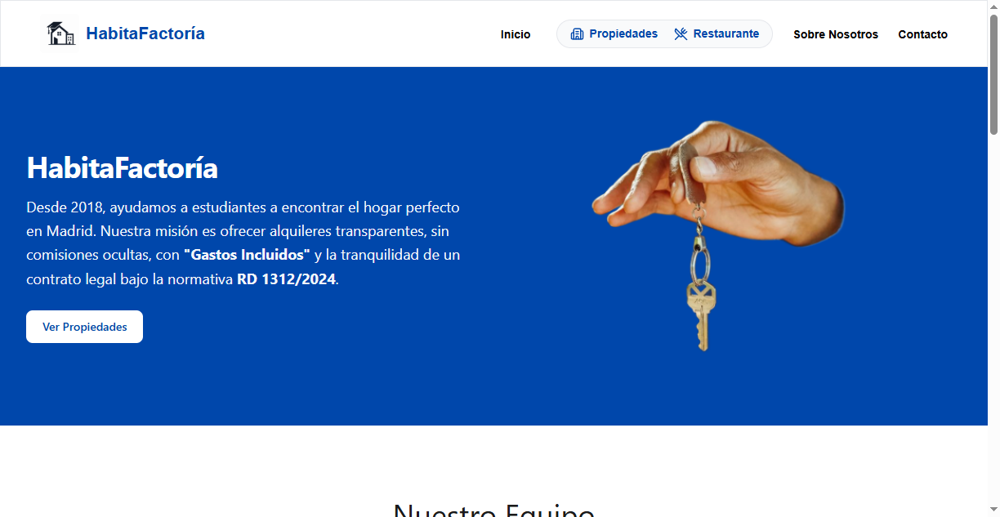
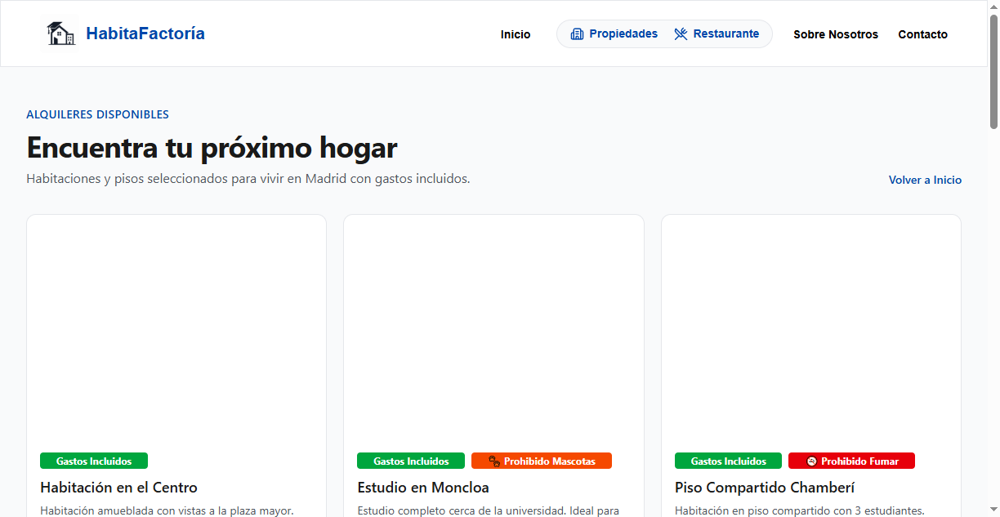
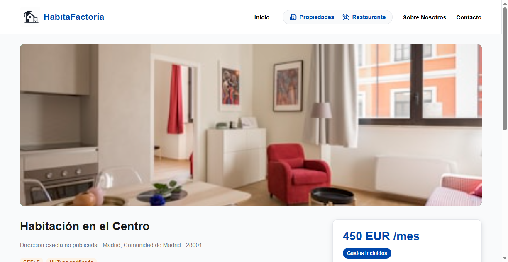
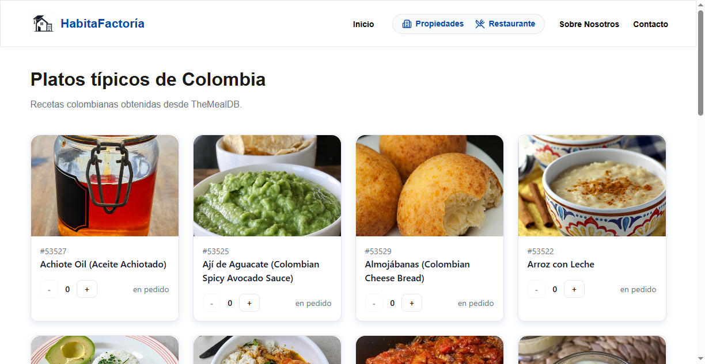
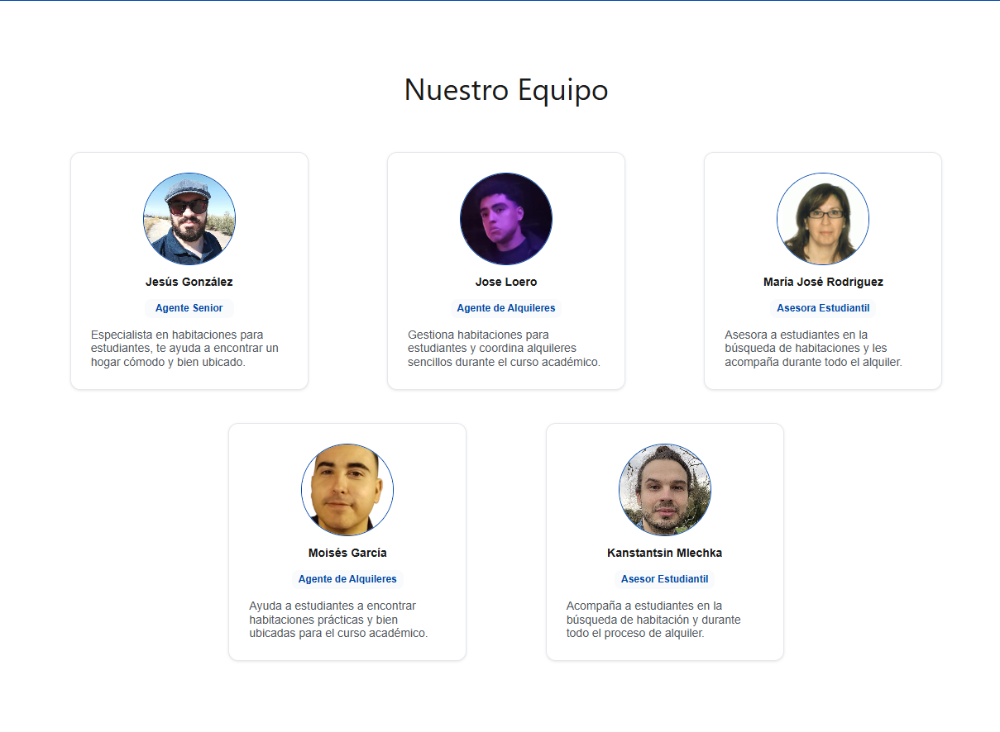
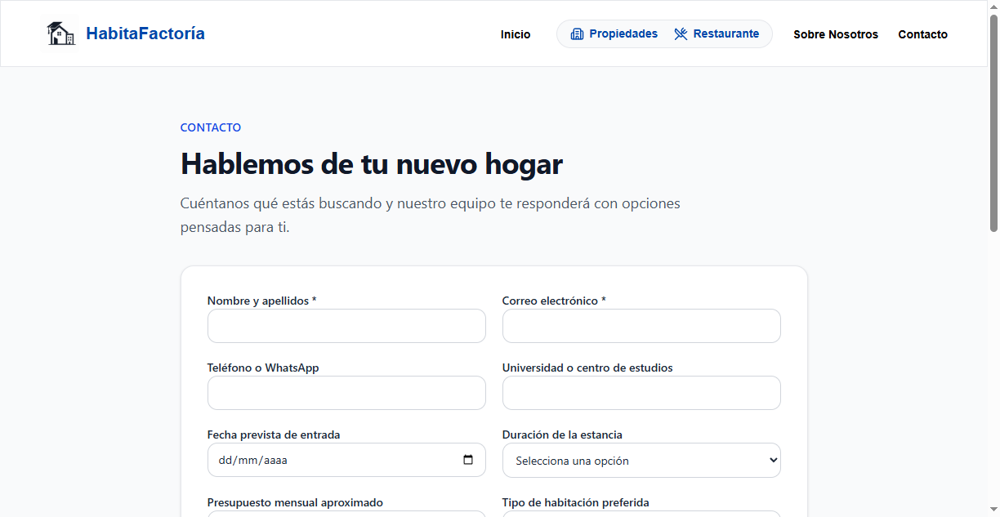

# HabitaFactoría

Portal de alquiler de vivienda para estudiantes en España. La app es un **híbrido**: inicio y búsqueda son páginas React clásicas; detalle, about y contacto se montan como **Semantic Scene Graph**. En el grafo, React describe *qué es* cada nodo (`data-*`), no solo cómo se ve. El diseño visual se generó en Penpot a partir de ese grafo y los tokens W3C del proyecto.

El frontend está construido con React y Vite. La parte inmobiliaria activa usa un **Semantic Scene Graph** con filosofía **Zero-Geometry**: los componentes describen qué representa cada elemento mediante atributos `data-*`, mientras que la geometría y la presentación viven en CSS/Tailwind.

> **Documentación completa del equipo (Notion):** [HabitaFactoría — Documentación del equipo](https://app.notion.com/p/3ae3c8c1bca880f2ba3eefa5eb26bafb)

## Estado del proyecto

El repositorio contiene un prototipo funcional de frontend, con navegación, vistas responsive, datos de prueba y estados de carga/error. No existe todavía un backend inmobiliario conectado: las propiedades y los datos de agencia proceden de fixtures locales. El pedido del restaurante se simula si no se configura una API propia.

- **React 19** + **Vite**, con **React Compiler** (`babel-plugin-react-compiler`)
- **React Router 7** — rutas definidas en [`src/App.jsx`](src/App.jsx)
- **Tailwind CSS 4** — layout y chrome; tokens W3C vía CSS variables
- **Style Dictionary** — tokens W3C (`trust` / `vibrant`) → `src/styles/tokens.css`
- **Lucide React** — iconos de navegación
- **Axios** — menú del mini-app Restaurante (TheMealDB)

### Portal inmobiliario

- Página de inicio con presentación de la agencia, misión, historia, equipo y vitrina de propiedades.
- Navegación responsive con menú móvil y agrupación visual de los servicios principales.
- Listado de propiedades con estados de carga, error y vacío.
- Fichas de detalle con dirección, precio, gastos incluidos, comodidades, agente asignado, certificado energético y acciones de contacto/visita.
- Catálogo unificado que acepta identificadores semánticos (`property-001`, `listing-1`) y antiguos identificadores numéricos.
- Página «Sobre Nosotros» con la historia de la agencia y cinco perfiles del equipo.
- Formulario de contacto con datos de búsqueda, preferencia de contacto, aceptación de privacidad y confirmación local del envío.
- Señales de transparencia representadas como datos semánticos: Bizum, gastos incluidos, registro profesional, registros autonómicos, CEE, DIA y distribución de honorarios.

### Restaurante

- Ruta `/restaurante` con platos colombianos obtenidos desde TheMealDB.
- Tarjetas de platos con imagen, nombre e identificador.
- Carrito en memoria con incremento, decremento, eliminación y vaciado.
- Confirmación de pedido con estado simulado por defecto o envío `POST` a una API configurada.
- Mensajes de carga, error y recuperación mediante `AppErrorBoundary`.

## Stack tecnológico

- **React 19** y `react-dom`.
- **Vite 8** como servidor y bundler.
- **React Router 7** para el enrutado del cliente.
- **Tailwind CSS 4** mediante `@tailwindcss/vite`.
- **React Compiler** mediante `reactCompilerPreset` y `babel-plugin-react-compiler`.
- **Lucide React** para iconos de navegación.
- **Axios** para TheMealDB y el endpoint opcional de pedidos.
- **Style Dictionary** y tokens W3C personalizados para los temas visuales.
- **ESLint 10** con reglas de React Hooks y React Refresh.

## Instalación y puesta en marcha

### Requisitos previos

El proyecto necesita **Node.js** y **npm**. npm se instala automáticamente junto con Node.js, por lo que no es necesario instalarlo por separado.

Comprueba que ambos comandos están disponibles:

```bash
node --version
npm --version
```

Si alguno no está disponible, instala la versión LTS de Node.js desde [nodejs.org](https://nodejs.org/). Después, cierra y vuelve a abrir la terminal para que Windows actualice el `PATH`.

### Clonar e instalar

```bash
git clone <URL_DEL_REPOSITORIO>
cd la-inmobiliaria
npm install
```

### Servidor de desarrollo

```bash
npm run dev
```

Vite mostrará la URL local, normalmente `http://localhost:5173`.

### Build de producción

```bash
npm run build
npm run preview
```

## Rutas

Montadas en [`src/App.jsx`](src/App.jsx). Toda la app va envuelta en [`SemanticActionRouter`](src/semantic-graph/SemanticActionRouter.jsx), que resuelve clics con `data-action-intent`.

| Ruta | Página montada |
| --- | --- |
| `/` | `Home` — historia, equipo, vitrina |
| `/buscar` | `Properties` — listado completo |
| `/properties` | Alias de `/buscar` |
| `/propiedad/:propertyId` | `DetailSceneGraph` — ficha (`listing-N` o `property-00N`) |
| `/contacto` | `ContactSceneGraph` |
| `/about` | `AboutSceneGraph` |
| `/restaurante` | Mini-app de menú colombiano |

`HomeSceneGraph` y `SearchSceneGraph` existen en `src/semantic-graph/pages/` (versión Zero-Geometry de inicio y búsqueda) pero **no están conectadas** al router.

## Estructura

```
src/
├── App.jsx                     # rutas montadas
├── pages/
│   ├── Home.jsx                # /  (HEADER / MAIN / FOOTER)
│   ├── Properties.jsx          # /buscar y /properties
│   └── RestaurantePage.jsx     # /restaurante
├── data/
│   └── mockData.js             # 12 anuncios mock + fetchProperties
├── components/
│   ├── layout/Header.jsx       # chrome de navegación
│   ├── layout/Footer.jsx       # footer de Home y Properties
│   ├── properties/             # PropertyList
│   ├── agents/                 # AgentCard / AgentList
│   └── ui/                     # Button, Card
├── restaurante/                # cart, API meals, estilos propios
├── styles/                     # tokens, header, team, detail, about
├── theme/                      # theme-trust.json / theme-vibrant.json
└── semantic-graph/
    ├── domainTypes.js          # formas de datos (JSDoc)
    ├── fixtures.js             # agencia, agentes, 3 propiedades semánticas
    ├── propertyCatalog.js      # fixtures + anuncios mock, lookup por id
    ├── manifest.js             # índice del grafo (nodos + relaciones)
    ├── SemanticActionRouter.jsx
    ├── nodes/                  # Property, Agency, Search, Contact, SiteChrome
    └── pages/                  # Detail / Contact / About (montadas)
                                # Home / Search (sin montar)
```

Datos de anuncios de inicio y búsqueda: [`src/data/mockData.js`](src/data/mockData.js). `propertyCatalog` los adapta al shape semántico para la ficha. `fixtures.js` cubre agencia, equipo y tres listings del grafo.

Cada página montada cumple **HEADER / MAIN / FOOTER**. Inicio y búsqueda usan `Header` + `Footer`; las escenas semánticas usan `SiteHeader` + `SiteFooter` (el header es el mismo componente).

La capa `src/semantic-graph` mantiene una representación semántica de los contenidos inmobiliarios:

Los requisitos de transparencia del mercado español viven como **dato** (detalle en Notion):

- **Bizum** como señal de confianza
- etiqueta **«Gastos Incluidos»**
- registros / licencia bajo **RD 1312/2024** (Ventanilla Única Digital) y DIA donde aplica

## Diseño y tokens

El diseño de referencia se realizó en Penpot con las escenas `home-page-001`, `search-page-001` y `detail-page-001` y el set `HabitaFactoría/Trust`.

**[Abrir el archivo en Penpot](https://design.penpot.app/#/view?file-id=8694f143-a620-8054-8008-6790ee178f11&page-id=2be68822-842f-8175-8008-677e92a06f90&section=interactions&index=0&share-id=2be68822-842f-8175-8008-6796bd4d3f53)**

## Capturas de la aplicación

Estas capturas corresponden al frontend ejecutándose en local y muestran el estado actual de las vistas principales:

| Inicio | Propiedades | Ficha de propiedad | Restaurante |
| :---: | :---: | :---: | :---: |
|  |  |  |  |

| Sobre Nosotros | Contacto |
| :---: | :---: |
|  |  |

Los tokens fuente están en `src/theme/` y el resultado generado en `src/styles/tokens.css`:

```bash
npm run build:tokens
npm run build:tokens:vibrant
```

Ambos comandos sobrescriben `src/styles/tokens.css`. El tema `Trust` es el estado versionado por defecto.

## Scripts

| Comando | Descripción |
| --- | --- |
| `npm run dev` | Inicia el servidor de desarrollo Vite |
| `npm run build` | Genera la build de producción en `dist/` |
| `npm run lint` | Ejecuta ESLint sobre el proyecto |
| `npm run preview` | Sirve localmente la build generada |
| `npm run build:tokens` | Genera tokens CSS desde `theme-trust.json` |
| `npm run build:tokens:vibrant` | Genera tokens CSS desde `theme-vibrant.json` |

## Calidad y colaboración

Antes de abrir una pull request:

```bash
npm run lint
npm run build
```

La guía de proyecto está en [`IDEA.md`](IDEA.md) y en [`.clinerules/Regla de la inmobiliaria.md`](.clinerules/Regla%20de%20la%20inmobiliaria.md). Se recomienda usar `camelCase` para variables y funciones, `PascalCase` para componentes y commits según [Conventional Commits](https://www.conventionalcommits.org/es/v1.0.0/).

## Equipo

| Nombre | Rol |
| --- | --- |
| Jesús González Gómez | Product Owner — define la visión del producto y prioriza el backlog |
| María José Rodríguez Ramos | Desarrolladora — construye componentes y funcionalidades del frontend |
| Jose Loero Nielez | Scrum Master — facilita los procesos ágiles y elimina impedimentos |
| Moisés García Sanz | Desarrollador — implementa características y optimiza el rendimiento |
| Konstantin Mlechka | Desarrollador — contribuye al código base y la arquitectura del proyecto |

## Limitaciones conocidas

- Los datos inmobiliarios son fixtures/mocks; no hay persistencia ni autenticación.
- El formulario de contacto solo muestra una confirmación local; no realiza una petición.
- «Solicitar visita», «Contactar con agente» y la descarga del DIA son acciones semánticas de demostración.
- Los registros, licencias, precios y textos legales están marcados como no verificados y no deben interpretarse como asesoramiento jurídico.
- La ruta `/restaurante` depende de la disponibilidad de TheMealDB.
- No hay una suite de tests automatizados configurada; la comprobación disponible actualmente es lint y build.

## Licencia

Proyecto académico ficticio — Inmobiliaria Factoría F5. No destinado a operaciones inmobiliarias reales.
