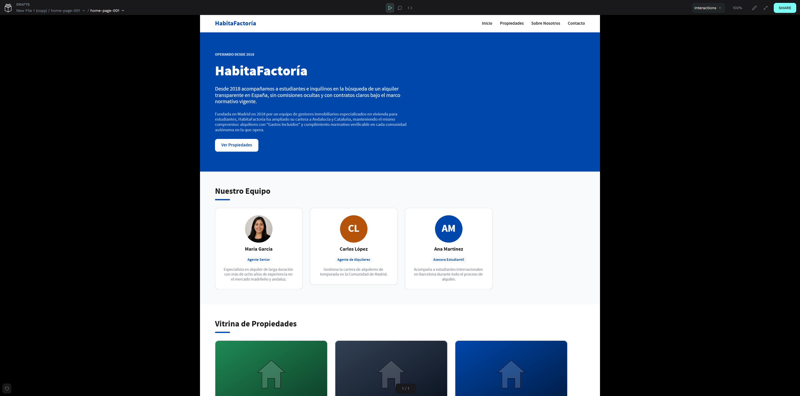
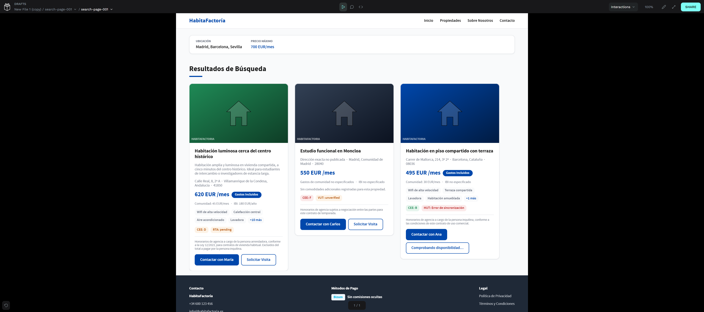
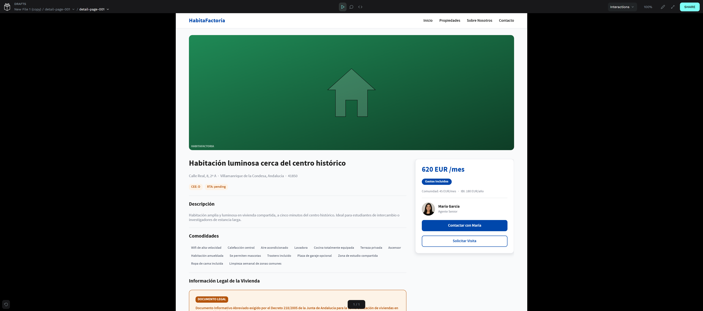

# HabitaFactoría

Portal de alquiler de vivienda para estudiantes en España, construido como **Semantic Scene Graph** con doctrina **Zero-Geometry**: la capa React describe *qué es* cada nodo (`data-*`), no cómo se ve. El diseño visual se generó en Penpot a partir de ese grafo y los tokens W3C del proyecto.

> **Documentación completa del equipo (Notion):**  
> [HabitaFactoría — Documentación del equipo](https://app.notion.com/p/3ae3c8c1bca880f2ba3eefa5eb26bafb)

Ahí está el material didáctico íntegro: mini-repaso de React con nuestro código, arquitectura archivo por archivo, cumplimiento normativo, tokens/Penpot y la guía de presentación.

---

## Stack

- **React 19** + **Vite**, con **React Compiler** (`babel-plugin-react-compiler`)
- **React Router 7** — rutas centralizadas en [`src/navigation/routes.js`](src/navigation/routes.js)
- **Tailwind CSS 4** — estilos de chrome y layout; la carpeta `src/semantic-graph` evita CSS de layout a propósito (Zero-Geometry)
- **Style Dictionary** — tokens W3C (`trust` / `vibrant`) → `src/styles/tokens.css`
- **Lucide React** — iconos de navegación
- **Axios** — menú del mini-app Restaurante (TheMealDB)

## Diseño

Diseño generado en Penpot (páginas `home-page-001`, `search-page-001`, `detail-page-001`) con el set de tokens `HabitaFactoria/Trust`:

**[Abrir el archivo en Penpot](https://design.penpot.app/#/view?file-id=8694f143-a620-8054-8008-6790ee178f11&page-id=2be68822-842f-8175-8008-677e92a06f90&section=interactions&index=0&share-id=2be68822-842f-8175-8008-6796bd4d3f53)**

| Inicio (`/`) | Búsqueda (`/buscar`) | Detalle (`/propiedad/:id`) |
| :---: | :---: | :---: |
|  |  |  |

## Inicio rápido

```bash
npm install
npm run dev
```

Regenerar tokens de diseño:

```bash
npm run build:tokens          # tema Trust
npm run build:tokens:vibrant  # tema Vibrant
```

## Rutas

| Ruta | Página |
| --- | --- |
| `/` | `HomeSceneGraph` — historia, equipo, vitrina |
| `/buscar` | `SearchSceneGraph` — listado completo |
| `/properties` | Alias de `/buscar` |
| `/propiedad/:propertyId` | `DetailSceneGraph` — ficha (ids `listing-N` o `property-00N`) |
| `/contacto` | `ContactSceneGraph` |
| `/about` | `AboutSceneGraph` |
| `/restaurante` | Mini-app de menú colombiano |

La navegación por `data-action-intent` la resuelve [`SemanticActionRouter`](src/semantic-graph/SemanticActionRouter.jsx) con el mismo mapa que el [`Header`](src/components/layout/Header.jsx).

## Estructura

```
src/
├── App.jsx                     # rutas
├── navigation/routes.js        # intents → paths (fuente única)
├── data/
│   ├── listings.js             # 12 anuncios mock (fuente única)
│   └── mockData.js             # fetchProperties → LISTINGS
├── hooks/useProperties.js      # loading / error / data
├── components/layout/Header.jsx
├── pages/RestaurantePage.jsx
├── restaurante/                # cart, API meals, estilos propios
├── styles/                     # tokens, header, team, detail, about
├── theme/                      # theme-trust.json / theme-vibrant.json
└── semantic-graph/
    ├── domainTypes.js          # formas de datos (JSDoc)
    ├── fixtures.js             # agencia, agentes, fixtures semánticos
    ├── propertyCatalog.js      # LISTINGS adaptados + lookup por id
    ├── manifest.js             # índice del grafo (nodos + relaciones)
    ├── SemanticActionRouter.jsx
    ├── nodes/                  # Property, Agency, Search, Contact, SiteChrome
    └── pages/                  # Home / Search / Detail / Contact / About
```

Datos de anuncios: editar solo [`src/data/listings.js`](src/data/listings.js). `propertyCatalog` los adapta al shape semántico; `fixtures.js` cubre agencia, equipo y nodos de dominio.

Cada página montada cumple **HEADER / MAIN / FOOTER** (`SiteHeader` + `SiteFooter` desde `SiteChrome`).

## Contexto español

Los requisitos de transparencia del mercado español viven como **dato** en la capa semántica (detalle en Notion):

- **Bizum** como señal de confianza
- etiqueta **«Gastos Incluidos»** (`data-inseparable-fact`)
- registros / licencia bajo **RD 1312/2024** (Ventanilla Única Digital) y DIA donde aplica

## Scripts

| Comando | Descripción |
| --- | --- |
| `npm run dev` | Servidor de desarrollo Vite |
| `npm run build` | Build de producción |
| `npm run lint` | ESLint |
| `npm run preview` | Vista previa del build |
| `npm run build:tokens` | Tokens Trust → `src/styles/tokens.css` |
| `npm run build:tokens:vibrant` | Tokens Vibrant → `src/styles/tokens.css` |

## Licencia

Proyecto académico — Inmobiliaria Factoría F5.
